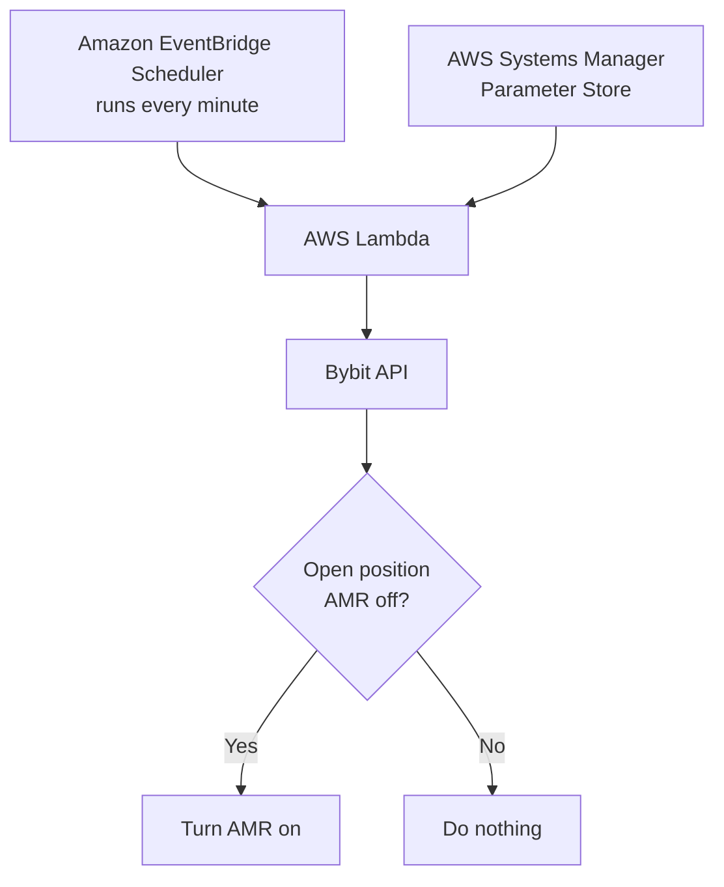

# Bybit Auto-Margin Replenishment (AMR) — Automatic Enable Guide

This guide is for people who already understand **Bybit, leverage, isolated margin, liquidation and open positions**, but do **not** need to know anything about trading bots, signal groups, Telegram, TradingView or Cornix.

The goal is simple:

> **Whenever a new Bybit isolated-margin position is open and Auto-Margin Replenishment (AMR) is OFF, AWS checks the account and switches AMR ON automatically.**

This automation does **not** place trades, change entries, change take-profit orders, change stop-loss orders, or read trading signals. It only checks open positions and enables AMR where it is off.

---

## 1. What is Auto-Margin Replenishment?

Auto-Margin Replenishment, or **AMR**, is a Bybit risk-management feature for **Isolated Margin** positions.

Normally, an isolated position has a fixed amount of margin behind it. If the market moves far enough against the position, the position moves closer to liquidation.

When AMR is enabled, Bybit can automatically take **available balance from your Unified Trading Account** and add it to that position when the margin level approaches the liquidation threshold.

That extra margin:

- reduces the position's **effective leverage**
- moves the liquidation price further away
- gives the position more room before liquidation

AMR does **not** guarantee that liquidation cannot happen. If the market keeps moving against the position, or the account runs out of available balance, the position can still be liquidated.

Bybit's official AMR explanation:  
https://www.bybit.com/en/help-center/article/Auto-Margin-Replenishment

---

## 2. When does AMR actually come into play?

AMR does not normally do anything just because a trade is slightly negative.

Think of it as an emergency layer:

```text
Position opens
    ↓
Normal market movement
    ↓
Position moves against you
    ↓
Position gets close to liquidation
    ↓
AMR uses available account balance
    ↓
More margin is added to the position
    ↓
Liquidation price moves further away
```

Bybit continues to add margin when needed, provided available balance remains and the position has not already been reduced to the equivalent of 1× effective leverage.

---

## 3. AMR needs spare account balance

AMR can only help if there is **unused balance available** in the Bybit account.

Example only:

```text
Account balance:     $1,000

Position 1 maximum:    $350
Position 2 maximum:    $350
                       ----
Trading allocation:    $700

Remaining balance:     $300
```

That remaining $300 is available for things such as AMR.

This is only an illustration of how a reserve works. It is **not** a recommendation that every trader should use 35% per position.

Also remember: the spare balance is a **shared pool**. Bybit does not reserve half for one position and half for another. One position could use more of it before another position needs help.

---

## 4. What we are going to build

We will use three AWS services:



The setup uses:

- **AWS Systems Manager → Parameter Store** to hold the Bybit API key and secret
- **AWS Lambda** to check open positions
- **Amazon EventBridge Scheduler** to run the check every minute

For this simple setup we do **not** need:

- a VPC
- a NAT Gateway
- EC2
- API Gateway
- a database

---

# Part A — Create the Bybit API key

## 5. Use a dedicated Bybit subaccount if possible

A dedicated subaccount is recommended because the API key then only has access to that subaccount.

Make sure you are logged into the **correct Bybit subaccount** before creating the key.

Bybit API keys are created on the **website**, not in the mobile app.

Official Bybit guide:  
https://www.bybit.com/en/help-center/article/How-to-create-your-API-key

---

## 6. Open Bybit API Management

On the Bybit website:

1. Log in.
2. Switch to the subaccount you want AMR automation to manage.
3. Click the **profile icon** in the top-right.
4. Open **API** or **API Management**.
5. Click **Create New Key**.
6. Choose **System-generated API Key**.

Use a **System-generated** key because this guide uses Bybit's normal HMAC signing method.

Do not choose a self-generated/RSA key for this guide.

---

## 7. Set the Bybit API permissions

Give the key **Read-Write** access because switching AMR on changes a position setting.

Under the trading permissions, enable:

```text
Positions: ON
Orders:    OFF, if Bybit allows it separately
```

Leave unrelated permissions off, especially:

```text
Withdrawals: OFF
Transfers:   OFF
Wallet:      OFF unless required by your own setup
Spot:        OFF
Earn:        OFF
```

Depending on the current Bybit interface, the section may be labelled **Unified Trading**, **Contract Trade**, or similar.

The important permission for this automation is **Positions**.

If Bybit forces Orders and Positions to be enabled together in your particular account interface, leave both enabled, but keep all unnecessary permissions disabled.

### IP restriction

This guide deliberately keeps Lambda **outside a VPC** to keep the setup simple and low cost.

A normal Lambda function does not have one fixed outbound public IP, so do **not** configure the Bybit key with a single IP restriction for this version of the setup.

---

## 8. Save the API key and API secret

After creating the key, Bybit displays:

```text
API Key
API Secret
```

Copy both immediately.

The API secret is sensitive and may only be shown when the key is created.

Do not put these values in GitHub, Lambda source code, screenshots, chat messages or public documents.

---

# Part B — Store the credentials in AWS

## 9. Choose your AWS Region

Log in to the AWS Console:

https://console.aws.amazon.com/

Look at the **top-right corner** of the AWS Console. You will see the current AWS Region.

Choose one Region and use the **same Region for Parameter Store, Lambda and EventBridge Scheduler**.

For example:

```text
Europe (Stockholm)
eu-north-1
```

You can use a different AWS Region. The important thing is to stay in the same Region throughout the setup.

---

## 10. Open Parameter Store

In the AWS Console search bar at the top, search for:

```text
Systems Manager
```

Open **AWS Systems Manager**.

In the left-hand menu, find:

```text
Parameter Store
```

Click **Create parameter**.

AWS documentation:  
https://docs.aws.amazon.com/systems-manager/latest/userguide/parameter-create-console.html

---

## 11. Create the API key parameter

Create the first parameter with these values:

```text
Name:
/trading/amr/bybit_api_key

Tier:
Standard

Type:
SecureString

KMS key:
Leave the default AWS-managed key
(alias/aws/ssm)

Value:
Paste the Bybit API Key
```

Save it.

---

## 12. Create the API secret parameter

Create a second parameter:

```text
Name:
/trading/amr/bybit_api_secret

Tier:
Standard

Type:
SecureString

KMS key:
Leave the default AWS-managed key
(alias/aws/ssm)

Value:
Paste the Bybit API Secret
```

Save it.

Do not put quotation marks around either value.

---

# Part C — Create the Lambda function

## 13. Open AWS Lambda

At the top of the AWS Console, confirm you are still in the **same Region** you used for Parameter Store.

Search for:

```text
Lambda
```

Open **AWS Lambda**.

Go to:

```text
Functions → Create function
```

Choose:

```text
Author from scratch
```

Use:

```text
Function name:
bybit-amr-manager

Runtime:
Choose the latest supported Python 3 runtime

Architecture:
x86_64
```

Leave the networking/VPC settings at their defaults.

Click **Create function**.

---

# Part D — Give Lambda permission to read the credentials

## 14. Find the Lambda execution role

Open:

```text
Lambda
→ Functions
→ bybit-amr-manager
→ Configuration
→ Permissions
```

Find **Execution role**.

You will see a blue role name similar to:

```text
bybit-amr-manager-role-xxxxxxxx
```

Click the **blue role name**.

This opens AWS IAM.

---

## 15. Create an inline IAM policy

On the IAM role page:

```text
Permissions
→ Add permissions
→ Create inline policy
→ JSON
```

Do not use the Lambda **Resource-based policy** section for this step.

We need the Lambda's **execution role**.

---

## 16. Find the two Parameter Store ARNs

Before pasting the IAM policy, get the exact ARN for each parameter.

Open another AWS Console tab and go to:

```text
Systems Manager
→ Parameter Store
```

Open:

```text
/trading/amr/bybit_api_key
```

On the parameter details page, copy the value labelled **ARN**.

It will look similar to:

```text
arn:aws:ssm:eu-north-1:123456789012:parameter/trading/amr/bybit_api_key
```

Then open:

```text
/trading/amr/bybit_api_secret
```

Copy its **ARN** as well.

You do not need to manually work out your AWS account number or Region because the ARN already contains them.

---

## 17. Paste the IAM policy

Back in:

```text
IAM
→ your Lambda execution role
→ Create inline policy
→ JSON
```

Paste:

```json
{
  "Version": "2012-10-17",
  "Statement": [
    {
      "Effect": "Allow",
      "Action": [
        "ssm:GetParameter",
        "ssm:GetParameters"
      ],
      "Resource": [
        "PASTE-THE-API-KEY-PARAMETER-ARN-HERE",
        "PASTE-THE-API-SECRET-PARAMETER-ARN-HERE"
      ]
    }
  ]
}
```

Replace the two obvious `PASTE-...` lines with the exact ARNs you copied from Parameter Store.

Click **Next**.

For the policy name enter:

```text
BybitAMRParameterRead
```

Then create the policy.

Leave the existing **AWSLambdaBasicExecutionRole** permission in place. Lambda uses that to write normal logs to CloudWatch.

---

# Part E — Add the AMR Lambda code

## 18. Open the Lambda code editor

Return to:

```text
AWS Lambda
→ Functions
→ bybit-amr-manager
→ Code
```

Open:

```text
lambda_function.py
```

Delete the existing example code.

Paste the complete code below.

---

## 19. AMR manager code

The code starts in **DRY RUN** mode.

That means it can see which positions need AMR, but it will not change anything until you deliberately turn dry-run mode off.

```python
import boto3
import hashlib
import hmac
import json
import time
import urllib.parse
import urllib.request
import urllib.error

ssm = boto3.client("ssm")

BYBIT_URL = "https://api.bybit.com"
RECV_WINDOW = "5000"

# SAFETY SWITCH
# True  = report what would be changed, but DON'T change anything
# False = actually enable AMR
DRY_RUN = True


def get_secret(name):
    return ssm.get_parameter(
        Name=name,
        WithDecryption=True
    )["Parameter"]["Value"].strip()


def make_signature(api_key, api_secret, timestamp, payload):
    string_to_sign = (
        timestamp
        + api_key
        + RECV_WINDOW
        + payload
    )

    return hmac.new(
        api_secret.encode("utf-8"),
        string_to_sign.encode("utf-8"),
        hashlib.sha256
    ).hexdigest()


def bybit_get(api_key, api_secret, path, params):

    query_string = urllib.parse.urlencode(
        sorted(params.items())
    )

    timestamp = str(int(time.time() * 1000))

    signature = make_signature(
        api_key,
        api_secret,
        timestamp,
        query_string
    )

    headers = {
        "X-BAPI-API-KEY": api_key,
        "X-BAPI-SIGN": signature,
        "X-BAPI-SIGN-TYPE": "2",
        "X-BAPI-TIMESTAMP": timestamp,
        "X-BAPI-RECV-WINDOW": RECV_WINDOW
    }

    url = f"{BYBIT_URL}{path}?{query_string}"

    request = urllib.request.Request(
        url,
        headers=headers,
        method="GET"
    )

    with urllib.request.urlopen(
        request,
        timeout=10
    ) as response:

        return json.loads(
            response.read().decode("utf-8")
        )


def bybit_post(api_key, api_secret, path, body):

    # The exact JSON we sign is also the exact JSON sent to Bybit.
    json_body = json.dumps(
        body,
        separators=(",", ":")
    )

    timestamp = str(int(time.time() * 1000))

    signature = make_signature(
        api_key,
        api_secret,
        timestamp,
        json_body
    )

    headers = {
        "Content-Type": "application/json",
        "X-BAPI-API-KEY": api_key,
        "X-BAPI-SIGN": signature,
        "X-BAPI-SIGN-TYPE": "2",
        "X-BAPI-TIMESTAMP": timestamp,
        "X-BAPI-RECV-WINDOW": RECV_WINDOW
    }

    request = urllib.request.Request(
        f"{BYBIT_URL}{path}",
        data=json_body.encode("utf-8"),
        headers=headers,
        method="POST"
    )

    with urllib.request.urlopen(
        request,
        timeout=10
    ) as response:

        return json.loads(
            response.read().decode("utf-8")
        )


def lambda_handler(event, context):

    api_key = get_secret(
        "/trading/amr/bybit_api_key"
    )

    api_secret = get_secret(
        "/trading/amr/bybit_api_secret"
    )

    try:

        data = bybit_get(
            api_key,
            api_secret,
            "/v5/position/list",
            {
                "category": "linear",
                "settleCoin": "USDT"
            }
        )

        if data.get("retCode") != 0:
            result = {
                "statusCode": 400,
                "message": "Could not read positions",
                "bybit": data
            }
            print(json.dumps(result))
            return result

        results = []

        for position in data["result"]["list"]:

            size = float(
                position.get("size", "0")
            )

            if size <= 0:
                continue

            symbol = position.get("symbol")
            auto_margin = position.get(
                "autoAddMargin"
            )

            position_idx = position.get(
                "positionIdx",
                0
            )

            # Already enabled
            if auto_margin in [1, "1"]:

                results.append({
                    "symbol": symbol,
                    "result": "AMR already ON"
                })

                continue

            # Safety test mode
            if DRY_RUN:

                results.append({
                    "symbol": symbol,
                    "result": "WOULD ENABLE AMR"
                })

                continue

            # Actually switch AMR on
            response = bybit_post(
                api_key,
                api_secret,
                "/v5/position/set-auto-add-margin",
                {
                    "category": "linear",
                    "symbol": symbol,
                    "autoAddMargin": 1,
                    "positionIdx": position_idx
                }
            )

            if response.get("retCode") == 0:

                results.append({
                    "symbol": symbol,
                    "result": "AMR ENABLED"
                })

            else:

                results.append({
                    "symbol": symbol,
                    "result": "ERROR",
                    "retCode": response.get(
                        "retCode"
                    ),
                    "retMsg": response.get(
                        "retMsg"
                    )
                })

        result = {
            "statusCode": 200,
            "dryRun": DRY_RUN,
            "positionsChecked": len(results),
            "results": results
        }

        print(json.dumps(result))
        return result

    except urllib.error.HTTPError as e:

        result = {
            "statusCode": e.code,
            "error": e.read().decode("utf-8")
        }

        print(json.dumps(result))
        return result

    except Exception as e:

        result = {
            "statusCode": 500,
            "error": str(e)
        }

        print(json.dumps(result))
        return result
```

There is nothing in this code that needs your AWS account number, Region or Bybit symbol.

The two Parameter Store names are already included.

---

# Part F — Test without changing a position

## 20. Deploy the code

At the top of the Lambda code editor click:

```text
Deploy
```

Wait for the confirmation that the function was updated.

---

## 21. Create a Lambda test

Click **Test**.

If AWS asks you to create a test event:

```text
Event name:
hello-world
```

Use this event:

```json
{}
```

Save it and click **Test** again.

Because:

```python
DRY_RUN = True
```

the Lambda will not alter your Bybit positions.

If you have an open position with AMR off, you should see something similar to:

```json
{
  "statusCode": 200,
  "dryRun": true,
  "positionsChecked": 1,
  "results": [
    {
      "symbol": "APTUSDT",
      "result": "WOULD ENABLE AMR"
    }
  ]
}
```

If AMR is already on, you should see:

```text
AMR already ON
```

If you have no open USDT perpetual positions, the result may simply show zero positions checked.

There is no need to open a new trade solely to test the Lambda.

---

# Part G — Turn automatic AMR on

## 22. Disable dry-run mode

Once the dry-run result is correct, change only this line:

```python
DRY_RUN = True
```

to:

```python
DRY_RUN = False
```

Click:

```text
Deploy
```

Then click:

```text
Test
```

If a position has AMR off, you should now see:

```text
AMR ENABLED
```

Run **Test** one more time.

The same position should now show:

```text
AMR already ON
```

This confirms the Lambda is safe to run repeatedly.

---

## 23. Confirm AMR in the Bybit app

In the Bybit mobile app:

```text
Trade
→ Positions
→ tap the open position
→ Margin
→ Auto-Margin Replenishment
```

The switch should now be **ON**.

Bybit's official guide confirms this mobile path:  
https://www.bybit.com/en/help-center/article/Auto-Margin-Replenishment

---

# Part H — Run the check automatically every minute

## 24. Open Amazon EventBridge Scheduler

In the AWS Console, first confirm the Region in the top-right is the **same Region as the Lambda**.

Search for:

```text
EventBridge Scheduler
```

Open **Amazon EventBridge Scheduler**.

Click:

```text
Create schedule
```

AWS documentation:  
https://docs.aws.amazon.com/scheduler/latest/UserGuide/getting-started.html

---

## 25. Create the schedule

Use:

```text
Schedule name:
bybit-amr-check

Schedule pattern:
Recurring schedule

Schedule type:
Rate-based schedule

Rate:
1 minute

Flexible time window:
Off
```

Click **Next**.

---

## 26. Choose the Lambda target

For the target choose:

```text
AWS Lambda
```

Select:

```text
bybit-amr-manager
```

For input/payload use:

```json
{}
```

Continue to the permissions step.

When AWS offers to create an execution role for the schedule, choose the option to let AWS **create a new role for this schedule**.

Review the settings and click **Create schedule**.

---

# Part I — Final result

You now have:

```text
Every 1 minute
      ↓
Amazon EventBridge Scheduler
      ↓
AWS Lambda
      ↓
Read open Bybit USDT perpetual positions
      ↓
AMR already ON?
   ↙              ↘
 YES               NO
Skip          Turn AMR ON
```

It does not matter how the trade was opened.

The position could have been opened:

- manually in Bybit
- by another trading platform
- by an API
- by any other execution service

The Lambda only cares that the position exists in the Bybit subaccount.

---

# Part J — Checking that it is running

## 27. Check Lambda monitoring

Open:

```text
AWS Lambda
→ Functions
→ bybit-amr-manager
→ Monitor
```

You should see invocations occurring automatically.

To inspect detailed logs:

```text
Monitor
→ View CloudWatch logs
```

The code writes a simple result into CloudWatch, for example:

```text
APTUSDT → AMR ENABLED
```

or:

```text
APTUSDT → AMR already ON
```

---

# Troubleshooting

## Bybit error 10004 — Error sign

If you see:

```text
retCode: 10004
Error sign
```

the most common fix is to recreate the Bybit API credentials.

Make sure:

1. the API key is **System-generated**
2. the API key and API secret belong to the same key
3. neither value has quotation marks or extra spaces
4. both values in Parameter Store were updated together

After creating a replacement key, update:

```text
/trading/amr/bybit_api_key
/trading/amr/bybit_api_secret
```

You do not need to change the Lambda code or IAM policy if the Parameter Store names stay the same.

---

## Lambda cannot read Parameter Store

Check:

```text
Lambda
→ bybit-amr-manager
→ Configuration
→ Permissions
→ Execution role
```

Click the role name and confirm the inline policy:

```text
BybitAMRParameterRead
```

exists.

Also confirm Parameter Store and Lambda are in the **same AWS Region**.

---

## Lambda sees no positions

Check that:

- there is currently an open position
- it is a **linear USDT** contract
- the API key belongs to the correct Bybit account/subaccount

This guide currently queries:

```text
category = linear
settleCoin = USDT
```

---

## AMR is unavailable in Bybit

AMR is intended for **Isolated Margin** positions.

If the position is using Cross Margin, the AMR control will not work in the same way because Cross Margin already uses available account margin differently.

---

## AMR keeps using account balance

This is expected behaviour.

AMR is specifically designed to use available balance to support a position as it approaches liquidation.

Do not enable AMR unless you understand that available account funds may be moved into a losing position.

---

# Security notes

This automation deliberately keeps permissions narrow.

Recommended setup:

```text
Dedicated Bybit subaccount
        ↓
Dedicated API key
        ↓
Position permission only where possible
        ↓
No withdrawal permission
        ↓
Credentials encrypted in Parameter Store
        ↓
Lambda can read only those two parameters
```

The Lambda code contains **no Bybit API key or API secret**.

Never commit real API credentials to GitHub.

---

# AWS cost note

This is a very small workload.

AWS Systems Manager Parameter Store supports **Standard** parameters, and the Lambda runs only briefly once per minute. EventBridge Scheduler also handles the minute-by-minute trigger.

Actual AWS billing depends on your account, Region and total AWS usage, so always check your AWS Billing dashboard rather than assuming the setup will always be free.

---

# Official documentation

**Bybit AMR**  
https://www.bybit.com/en/help-center/article/Auto-Margin-Replenishment

**Bybit API — Set Auto Add Margin**  
https://bybit-exchange.github.io/docs/v5/position/auto-add-margin

**Bybit API — Get Position Info**  
https://bybit-exchange.github.io/docs/v5/position

**Bybit — Create API Key**  
https://www.bybit.com/en/help-center/article/How-to-create-your-API-key

**AWS Systems Manager Parameter Store**  
https://docs.aws.amazon.com/systems-manager/latest/userguide/systems-manager-parameter-store.html

**AWS EventBridge Scheduler**  
https://docs.aws.amazon.com/scheduler/latest/UserGuide/getting-started.html

---

## Important

AMR is a risk-management tool, not a guarantee against liquidation.

It can increase the amount of account capital committed to a losing position. Make sure you understand the maximum amount of available balance that could be used before enabling it on a live trading account.
