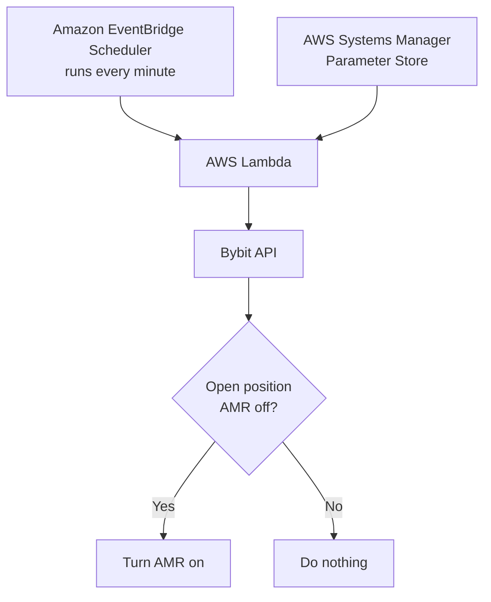

# Bybit Auto-Margin Replenishment (AMR) — Automatic Enable Guide

This guide is for people who already understand **Bybit, leverage, isolated margin, liquidation and open positions**, but do **not** need to know anything about trading bots, signal groups, Telegram, TradingView or Cornix.

The goal is simple:

> **Whenever a new Bybit isolated-margin position is open and Auto-Margin Replenishment (AMR) is OFF, AWS checks the account and switches AMR ON automatically.**

This automation does **not** place trades, change entries, change take-profit orders, change stop-loss orders, or read trading signals. It only checks open positions and enables AMR where it is off.

## Before you start — what you need

You need:

- a **Bybit account** with the positions you want AMR to protect
- an **AWS account** — AWS means **Amazon Web Services**
- a desktop web browser for the AWS setup
- access to the email address and security checks for both accounts
- about 20–30 minutes for the first setup

If you **do not have an AWS account**, that is fine. This guide includes the AWS account creation steps below.

You do **not** need to understand programming, servers, networking, trading bots, signal groups or webhooks to follow this guide.

## Plain-English glossary

You do not need to memorise these terms. This table is here so that when AWS or Bybit uses an abbreviation, you know what it means.

| Term | Plain-English meaning |
|---|---|
| **AMR** | **Auto-Margin Replenishment**. Bybit can add spare account balance to an isolated position when it gets close to liquidation. |
| **AWS** | **Amazon Web Services**. The cloud service we use to run the automatic check. |
| **API** | **Application Programming Interface**. A controlled way for one service to talk to another. Here, AWS talks to Bybit through Bybit's API. |
| **API key** | An identifier that tells Bybit which account or subaccount is making the request. Think of it like a username for software. |
| **API secret** | The private secret paired with the API key. Think of it like the password. Never share it. |
| **Lambda** | An AWS service that runs a small piece of code only when needed. There is no server for you to manage. |
| **EventBridge Scheduler** | The AWS timer that tells Lambda to run every minute. |
| **Parameter Store** | An AWS place for storing values. In this guide it stores the Bybit API key and API secret. |
| **SecureString** | A Parameter Store value that is stored encrypted rather than as ordinary readable text. |
| **IAM** | **Identity and Access Management**. AWS permissions. It controls what the Lambda is allowed to do. |
| **SSM** | **Systems Manager**. AWS still uses the letters `ssm` in technical names such as `ssm:GetParameter` and `alias/aws/ssm`. If you see SSM in this guide or in AWS, think **Systems Manager**. |
| **Execution role** | The set of AWS permissions given to the Lambda function. |
| **ARN** | **Amazon Resource Name**. AWS's unique full name for a resource. We copy the ARN from the screen rather than trying to build it ourselves. |
| **KMS** | **Key Management Service**. AWS's encryption-key service. Parameter Store uses it to encrypt and decrypt SecureString values. |
| **HMAC** | A way of proving an API request really came from someone who knows the API secret. Bybit's system-generated API keys use this method. |
| **RSA** | Another cryptographic signing method. This guide does **not** use an RSA/self-generated Bybit key. |
| **USDT** | Tether USD. In this guide the Lambda checks USDT linear perpetual positions. |
| **VPC** | **Virtual Private Cloud**. A private AWS network. We do not need one for this simple setup. |
| **NAT Gateway** | An AWS networking service often used to give private resources internet access. We do not need one here. |
| **EC2** | **Elastic Compute Cloud**. Traditional AWS virtual servers. We do not need EC2 here. |
| **CloudWatch Logs** | The AWS log screen where you can see what the Lambda did. |
| **Region** | The AWS geographical area where your resources live, for example Europe (Stockholm). Keep the Lambda, Parameter Store and Scheduler in the same Region. |
| **Root user** | The owner-level login for an AWS account. It has complete control, so protect it carefully. |
| **MFA** | **Multi-Factor Authentication**. A second security check, usually an authenticator app or security key, in addition to your password. |
| **JSON** | A simple text format used to pass structured information between systems. You only copy the small examples shown in this guide. |
| **HTTPS** | **Hypertext Transfer Protocol Secure**. Encrypted web traffic. The Lambda uses HTTPS to talk securely to Bybit. |
| **IP address** | **Internet Protocol address**. The network address a device or service appears to use on the internet. This version does not rely on a fixed Lambda IP address. |

---

## 1. What is Auto-Margin Replenishment?

Auto-Margin Replenishment, or **AMR**, is a Bybit risk-management feature for **Isolated Margin** positions.

Normally, an isolated position has a fixed amount of margin behind it. If the market moves far enough against the position, the position moves closer to liquidation.

When AMR is enabled, Bybit can automatically take **available balance from your Unified Trading Account** and add it to that position when the margin level approaches the liquidation threshold.

That extra margin:

- reduces the position's **effective leverage**
- moves the liquidation price further away
- gives the position more room before liquidation

AMR does **not** guarantee that liquidation cannot happen. If the market keeps moving against the position, or the account runs out of available balance, the position can still be liquidated.

Bybit's official AMR explanation:  
https://www.bybit.com/en/help-center/article/Auto-Margin-Replenishment

---

## 2. When does AMR actually come into play?

AMR does not normally do anything just because a trade is slightly negative.

Think of it as an emergency layer:

```text
Position opens
    ↓
Normal market movement
    ↓
Position moves against you
    ↓
Position gets close to liquidation
    ↓
AMR uses available account balance
    ↓
More margin is added to the position
    ↓
Liquidation price moves further away
```

Bybit continues to add margin when needed, provided available balance remains and the position has not already been reduced to the equivalent of 1× effective leverage.

---

## 3. AMR needs spare account balance

AMR can only help if there is **unused balance available** in the Bybit account.

Example only:

```text
Account balance:     $1,000

Position 1 maximum:    $350
Position 2 maximum:    $350
                       ----
Trading allocation:    $700

Remaining balance:     $300
```

That remaining $300 is available for things such as AMR.

This is only an illustration of how a reserve works. It is **not** a recommendation that every trader should use 35% per position.

Also remember: the spare balance is a **shared pool**. Bybit does not reserve half for one position and half for another. One position could use more of it before another position needs help.

---

## 4. What we are going to build

We will use three AWS services:



The setup uses:

- **AWS Systems Manager → Parameter Store** to hold the Bybit API key and secret
- **AWS Lambda** to check open positions
- **Amazon EventBridge Scheduler** to run the check every minute

For this simple setup we do **not** need:

- a VPC
- a NAT Gateway
- EC2
- API Gateway
- a database

---

# Part 0 — Create an AWS account

If you already have an AWS account, skip to **Part A**.

## 5. Open the AWS sign-up page

Go to:

https://aws.amazon.com/

Click **Create an AWS Account** or **Create account**.

AWS may show a newer sign-up screen that lets you sign in with an existing provider such as Google, GitHub, Apple or Amazon. It may instead show the traditional AWS account form. Either route is fine.

Official AWS account setup guide:  
https://docs.aws.amazon.com/accounts/latest/reference/getting-started.html

---

## 6. Choose an AWS account plan

AWS currently offers new customers a choice between a **Free plan** and a **Paid plan**.

For someone setting up this AMR checker for the first time, the **Free plan is a sensible place to start** if AWS makes all the services in this guide available to you.

The Free plan is designed so you do not incur AWS usage charges while you are on that plan. It ends after **six months or when its available credits are used up, whichever happens first**.

If you want this AMR automation to keep running after the Free plan ends, you must upgrade the AWS account to the **Paid plan** before access is lost.

The Paid plan is normal pay-as-you-go AWS. The AMR checker is a very small workload and the core services used here have generous free monthly allowances, explained in **Appendix A — AWS free limits and expected cost**.

Official AWS plan information:  
https://docs.aws.amazon.com/awsaccountbilling/latest/aboutv2/free-tier-plans.html

---

## 7. Create and verify the AWS account

Follow the AWS sign-up screens.

AWS may ask you for:

1. **Email / sign-in method** — use an email address you control long term.
2. **Your name or account name** — this is simply the name shown for the AWS account.
3. **Email verification** — AWS sends a code to your email.
4. **Contact details** — enter the requested name, address and phone details.
5. **Payment method, if requested** — AWS says most new sign-ups do not always require one, but it can request payment details for identity verification. If AWS performs card verification it may place a temporary **USD $1 (or equivalent) authorisation**, normally released after a few days.
6. **Phone verification, if requested** — AWS may text a verification code.
7. **Support plan, if shown** — choose the free/basic support option unless you specifically want a paid support plan.
8. **Complete sign-up**.

Account activation is usually quick, but AWS says it can sometimes take up to 24 hours.

Current AWS sign-up information:  
https://docs.aws.amazon.com/accounts/latest/reference/sign-in-new.html

---

## 8. Secure the AWS account with MFA

**MFA means Multi-Factor Authentication.** It adds a second security check to your AWS sign-in.

AWS now has more than one sign-up experience, so what you see can differ:

- if your account uses the traditional **root user** sign-in, AWS requires root-user MFA to be configured
- if you signed up through the newer AWS sign-in experience using an identity such as Google, GitHub, Apple, Amazon or an AWS Builder ID, follow the security/MFA prompts shown for that sign-in

If you have a traditional root-user account, you can normally find the setting here:

1. Sign in to AWS.
2. Click your **account name/menu in the top-right**.
3. Open **Security credentials**.
4. Find **Multi-factor authentication (MFA)**.
5. Choose **Assign MFA device**.
6. Follow the instructions for your authenticator app or security key.

AWS root-user security guidance:  
https://docs.aws.amazon.com/IAM/latest/UserGuide/root-user-best-practices.html

The **root user** is the owner-level login for the whole AWS account. If your account has one, do not create AWS access keys for it and do not share its password.

---

## 9. Find and choose your AWS Region

After you sign in to the AWS Console, look at the **top-right corner**.

You will see a Region name such as:

```text
Europe (Stockholm)
```

When you click it, AWS also shows the Region code, for example:

```text
eu-north-1
```

Choose one Region and keep using that same Region throughout this guide.

For consistency, this guide uses:

```text
Europe (Stockholm)
eu-north-1
```

**Do not assume Stockholm will already be selected.** AWS can open the Console in a different Region depending on your account, your previous session, or the service you last used.

Before creating each of these resources, look at the **Region selector in the top-right of the AWS Console** and make sure it says:

```text
Europe (Stockholm)
eu-north-1
```

Check this before creating:

- Systems Manager → Parameter Store
- Lambda
- EventBridge Scheduler

Some AWS services, such as **IAM (Identity and Access Management)**, are global rather than regional, so they may not show a Region in the same way.

The important rule is:

> **Parameter Store + Lambda + EventBridge Scheduler must all be created in the same AWS Region.**

---

## 10. Know where to check AWS usage and billing

In the AWS Console:

1. Click your **account menu in the top-right**.
2. Open **Billing and Cost Management**.
3. Look for the **Free Tier / Credits / Cost and Usage** information shown for your account.

This is where you check whether any AWS charges are building up.

If you are on a Paid plan, it is also sensible to create an AWS Budget alert so AWS can email you if costs rise unexpectedly.

AWS Free Tier tracking guide:  
https://docs.aws.amazon.com/awsaccountbilling/latest/aboutv2/tracking-free-tier-usage.html

---

# Part A — Create the Bybit API key

## 11. Use a dedicated Bybit subaccount if possible

A dedicated subaccount is recommended because the API key then only has access to that subaccount.

Make sure you are logged into the **correct Bybit subaccount** before creating the key.

Bybit API keys are created on the **website**, not in the mobile app.

Official Bybit guide:  
https://www.bybit.com/en/help-center/article/How-to-create-your-API-key

---

## 12. Open Bybit API Management

On the Bybit website:

1. Log in.
2. Switch to the subaccount you want AMR automation to manage.
3. Click the **profile icon** in the top-right.
4. Open **API** or **API Management**.
5. Click **Create New Key**.
6. Choose **System-generated API Key**.

Use a **System-generated** key because this guide uses Bybit's normal HMAC signing method.

Do not choose a self-generated/RSA key for this guide.

---

## 13. Set the Bybit API permissions

Give the key **Read-Write** access because switching AMR on changes a position setting.

Under the trading permissions, enable:

```text
Positions: ON
Orders:    OFF, if Bybit allows it separately
```

Leave unrelated permissions off, especially:

```text
Withdrawals: OFF
Transfers:   OFF
Wallet:      OFF unless required by your own setup
Spot:        OFF
Earn:        OFF
```

Depending on the current Bybit interface, the section may be labelled **Unified Trading**, **Contract Trade**, or similar.

The important permission for this automation is **Positions**.

If Bybit forces Orders and Positions to be enabled together in your particular account interface, leave both enabled, but keep all unnecessary permissions disabled.

### IP restriction

This guide deliberately keeps Lambda **outside a VPC** to keep the setup simple and low cost.

A normal Lambda function does not have one fixed outbound public IP, so do **not** configure the Bybit key with a single IP restriction for this version of the setup.

---

## 14. Save the API key and API secret

After creating the key, Bybit displays:

```text
API Key
API Secret
```

Copy both immediately.

The API secret is sensitive and may only be shown when the key is created.

Do not put these values in GitHub, Lambda source code, screenshots, chat messages or public documents.

---

# Part B — Store the credentials in AWS

## 15. Choose your AWS Region

Log in to the AWS Console:

https://console.aws.amazon.com/

Look at the **top-right corner** of the AWS Console. You will see the current AWS Region.

Choose one Region and use the **same Region for Parameter Store, Lambda and EventBridge Scheduler**.

For example:

```text
Europe (Stockholm)
eu-north-1
```

You can use a different AWS Region. The important thing is to stay in the same Region throughout the setup.

---

## 16. Open Parameter Store

In the AWS Console search bar at the top, search for:

```text
Systems Manager
```

Open **AWS Systems Manager**.

In the left-hand menu, find:

```text
Parameter Store
```

Click **Create parameter**.

AWS documentation:  
https://docs.aws.amazon.com/systems-manager/latest/userguide/parameter-create-console.html

---

## 17. Create the API key parameter

Create the first parameter with these values:

```text
Name:
/trading/amr/bybit_api_key

Tier:
Standard

Type:
SecureString

KMS key:
Leave the default AWS-managed key
(alias/aws/ssm)

Value:
Paste the Bybit API Key
```

Save it.

---

## 18. Create the API secret parameter

Create a second parameter:

```text
Name:
/trading/amr/bybit_api_secret

Tier:
Standard

Type:
SecureString

KMS key:
Leave the default AWS-managed key
(alias/aws/ssm)

Value:
Paste the Bybit API Secret
```

Save it.

Do not put quotation marks around either value.

---

# Part C — Create the Lambda function

## 19. Open AWS Lambda

At the top of the AWS Console, confirm you are still in the **same Region** you used for Parameter Store.

Search for:

```text
Lambda
```

Open **AWS Lambda**.

Go to:

```text
Functions → Create function
```

Choose:

```text
Author from scratch
```

Use:

```text
Function name:
bybit-amr-manager

Runtime:
Choose the latest supported Python 3 runtime

Architecture:
x86_64
```

Leave the networking/VPC settings at their defaults.

Click **Create function**.

---

# Part D — Give Lambda permission to read the credentials

## 20. Find the Lambda execution role

Open:

```text
Lambda
→ Functions
→ bybit-amr-manager
→ Configuration
→ Permissions
```

Find **Execution role**.

You will see a blue role name similar to:

```text
bybit-amr-manager-role-xxxxxxxx
```

Click the **blue role name**.

This opens AWS IAM.

---

## 21. Create an inline IAM policy

On the IAM role page:

```text
Permissions
→ Add permissions
→ Create inline policy
→ JSON
```

Do not use the Lambda **Resource-based policy** section for this step.

We need the Lambda's **execution role**.

---

## 22. Find the two Parameter Store ARNs

Before pasting the IAM policy, get the exact ARN for each parameter.

Open another AWS Console tab and go to:

```text
Systems Manager
→ Parameter Store
```

Open:

```text
/trading/amr/bybit_api_key
```

On the parameter details page, copy the value labelled **ARN**.

It will look similar to:

```text
arn:aws:ssm:eu-north-1:123456789012:parameter/trading/amr/bybit_api_key
```

Then open:

```text
/trading/amr/bybit_api_secret
```

Copy its **ARN** as well.

You do not need to manually work out your AWS account number or Region because the ARN already contains them.

---

## 23. Paste the IAM policy

Back in:

```text
IAM
→ your Lambda execution role
→ Create inline policy
→ JSON
```

Paste:

```json
{
  "Version": "2012-10-17",
  "Statement": [
    {
      "Effect": "Allow",
      "Action": [
        "ssm:GetParameter",
        "ssm:GetParameters"
      ],
      "Resource": [
        "PASTE-THE-API-KEY-PARAMETER-ARN-HERE",
        "PASTE-THE-API-SECRET-PARAMETER-ARN-HERE"
      ]
    }
  ]
}
```

Replace the two obvious `PASTE-...` lines with the exact ARNs you copied from Parameter Store.

Click **Next**.

For the policy name enter:

```text
BybitAMRParameterRead
```

Then create the policy.

Leave the existing **AWSLambdaBasicExecutionRole** permission in place. Lambda uses that to write normal logs to CloudWatch.

---

# Part E — Add the AMR Lambda code

## 24. Open the Lambda code editor

Return to:

```text
AWS Lambda
→ Functions
→ bybit-amr-manager
→ Code
```

Open:

```text
lambda_function.py
```

Delete the existing example code.

Paste the complete code below.

---

## 25. AMR manager code

The code starts in **DRY RUN** mode.

That means it can see which positions need AMR, but it will not change anything until you deliberately turn dry-run mode off.

```python
import boto3
import hashlib
import hmac
import json
import time
import urllib.parse
import urllib.request
import urllib.error

ssm = boto3.client("ssm")

BYBIT_URL = "https://api.bybit.com"
RECV_WINDOW = "5000"

# SAFETY SWITCH
# True  = report what would be changed, but DON'T change anything
# False = actually enable AMR
DRY_RUN = True


def get_secret(name):
    return ssm.get_parameter(
        Name=name,
        WithDecryption=True
    )["Parameter"]["Value"].strip()


def make_signature(api_key, api_secret, timestamp, payload):
    string_to_sign = (
        timestamp
        + api_key
        + RECV_WINDOW
        + payload
    )

    return hmac.new(
        api_secret.encode("utf-8"),
        string_to_sign.encode("utf-8"),
        hashlib.sha256
    ).hexdigest()


def bybit_get(api_key, api_secret, path, params):

    query_string = urllib.parse.urlencode(
        sorted(params.items())
    )

    timestamp = str(int(time.time() * 1000))

    signature = make_signature(
        api_key,
        api_secret,
        timestamp,
        query_string
    )

    headers = {
        "X-BAPI-API-KEY": api_key,
        "X-BAPI-SIGN": signature,
        "X-BAPI-SIGN-TYPE": "2",
        "X-BAPI-TIMESTAMP": timestamp,
        "X-BAPI-RECV-WINDOW": RECV_WINDOW
    }

    url = f"{BYBIT_URL}{path}?{query_string}"

    request = urllib.request.Request(
        url,
        headers=headers,
        method="GET"
    )

    with urllib.request.urlopen(
        request,
        timeout=10
    ) as response:

        return json.loads(
            response.read().decode("utf-8")
        )


def bybit_post(api_key, api_secret, path, body):

    # The exact JSON we sign is also the exact JSON sent to Bybit.
    json_body = json.dumps(
        body,
        separators=(",", ":")
    )

    timestamp = str(int(time.time() * 1000))

    signature = make_signature(
        api_key,
        api_secret,
        timestamp,
        json_body
    )

    headers = {
        "Content-Type": "application/json",
        "X-BAPI-API-KEY": api_key,
        "X-BAPI-SIGN": signature,
        "X-BAPI-SIGN-TYPE": "2",
        "X-BAPI-TIMESTAMP": timestamp,
        "X-BAPI-RECV-WINDOW": RECV_WINDOW
    }

    request = urllib.request.Request(
        f"{BYBIT_URL}{path}",
        data=json_body.encode("utf-8"),
        headers=headers,
        method="POST"
    )

    with urllib.request.urlopen(
        request,
        timeout=10
    ) as response:

        return json.loads(
            response.read().decode("utf-8")
        )


def lambda_handler(event, context):

    api_key = get_secret(
        "/trading/amr/bybit_api_key"
    )

    api_secret = get_secret(
        "/trading/amr/bybit_api_secret"
    )

    try:

        data = bybit_get(
            api_key,
            api_secret,
            "/v5/position/list",
            {
                "category": "linear",
                "settleCoin": "USDT"
            }
        )

        if data.get("retCode") != 0:
            result = {
                "statusCode": 400,
                "message": "Could not read positions",
                "bybit": data
            }
            print(json.dumps(result))
            return result

        results = []

        for position in data["result"]["list"]:

            size = float(
                position.get("size", "0")
            )

            if size <= 0:
                continue

            symbol = position.get("symbol")
            auto_margin = position.get(
                "autoAddMargin"
            )

            position_idx = position.get(
                "positionIdx",
                0
            )

            # Already enabled
            if auto_margin in [1, "1"]:

                results.append({
                    "symbol": symbol,
                    "result": "AMR already ON"
                })

                continue

            # Safety test mode
            if DRY_RUN:

                results.append({
                    "symbol": symbol,
                    "result": "WOULD ENABLE AMR"
                })

                continue

            # Actually switch AMR on
            response = bybit_post(
                api_key,
                api_secret,
                "/v5/position/set-auto-add-margin",
                {
                    "category": "linear",
                    "symbol": symbol,
                    "autoAddMargin": 1,
                    "positionIdx": position_idx
                }
            )

            if response.get("retCode") == 0:

                results.append({
                    "symbol": symbol,
                    "result": "AMR ENABLED"
                })

            else:

                results.append({
                    "symbol": symbol,
                    "result": "ERROR",
                    "retCode": response.get(
                        "retCode"
                    ),
                    "retMsg": response.get(
                        "retMsg"
                    )
                })

        result = {
            "statusCode": 200,
            "dryRun": DRY_RUN,
            "positionsChecked": len(results),
            "results": results
        }

        print(json.dumps(result))
        return result

    except urllib.error.HTTPError as e:

        result = {
            "statusCode": e.code,
            "error": e.read().decode("utf-8")
        }

        print(json.dumps(result))
        return result

    except Exception as e:

        result = {
            "statusCode": 500,
            "error": str(e)
        }

        print(json.dumps(result))
        return result
```

There is nothing in this code that needs your AWS account number, Region or Bybit symbol.

The two Parameter Store names are already included.

---

# Part F — Test without changing a position

## 26. Deploy the code

At the top of the Lambda code editor click:

```text
Deploy
```

Wait for the confirmation that the function was updated.

---

## 27. Create a Lambda test

Click **Test**.

If AWS asks you to create a test event:

```text
Event name:
hello-world
```

Use this event:

```json
{}
```

Save it and click **Test** again.

Because:

```python
DRY_RUN = True
```

the Lambda will not alter your Bybit positions.

If you have an open position with AMR off, you should see something similar to:

```json
{
  "statusCode": 200,
  "dryRun": true,
  "positionsChecked": 1,
  "results": [
    {
      "symbol": "APTUSDT",
      "result": "WOULD ENABLE AMR"
    }
  ]
}
```

If AMR is already on, you should see:

```text
AMR already ON
```

If you have no open USDT perpetual positions, the result may simply show zero positions checked.

There is no need to open a new trade solely to test the Lambda.

---

# Part G — Turn automatic AMR on

## 28. Disable dry-run mode

Once the dry-run result is correct, change only this line:

```python
DRY_RUN = True
```

to:

```python
DRY_RUN = False
```

Click:

```text
Deploy
```

Then click:

```text
Test
```

If a position has AMR off, you should now see:

```text
AMR ENABLED
```

Run **Test** one more time.

The same position should now show:

```text
AMR already ON
```

This confirms the Lambda is safe to run repeatedly.

---

## 29. Confirm AMR in the Bybit app

In the Bybit mobile app:

```text
Trade
→ Positions
→ tap the open position
→ Margin
→ Auto-Margin Replenishment
```

The switch should now be **ON**.

Bybit's official guide confirms this mobile path:  
https://www.bybit.com/en/help-center/article/Auto-Margin-Replenishment

---

# Part H — Run the check automatically every minute

## 30. Open Amazon EventBridge Scheduler

In the AWS Console, first confirm the Region in the top-right is the **same Region as the Lambda**.

Search for:

```text
EventBridge Scheduler
```

Open **Amazon EventBridge Scheduler**.

Click:

```text
Create schedule
```

AWS documentation:  
https://docs.aws.amazon.com/scheduler/latest/UserGuide/getting-started.html

---

## 31. Create the schedule

Use:

```text
Schedule name:
bybit-amr-check

Schedule pattern:
Recurring schedule

Schedule type:
Rate-based schedule

Rate:
1 minute

Flexible time window:
Off
```

Click **Next**.

---

## 32. Choose the Lambda target

For the target choose:

```text
AWS Lambda
```

Select:

```text
bybit-amr-manager
```

For input/payload use:

```json
{}
```

Continue to the permissions step.

When AWS offers to create an execution role for the schedule, choose the option to let AWS **create a new role for this schedule**.

Review the settings and click **Create schedule**.

---

# Part I — Final result

You now have:

```text
Every 1 minute
      ↓
Amazon EventBridge Scheduler
      ↓
AWS Lambda
      ↓
Read open Bybit USDT perpetual positions
      ↓
AMR already ON?
   ↙              ↘
 YES               NO
Skip          Turn AMR ON
```

It does not matter how the trade was opened.

The position could have been opened:

- manually in Bybit
- by another trading platform
- by an API
- by any other execution service

The Lambda only cares that the position exists in the Bybit subaccount.

---

# Part J — Checking that it is running

## 33. Check Lambda monitoring

Open:

```text
AWS Lambda
→ Functions
→ bybit-amr-manager
→ Monitor
```

You should see invocations occurring automatically.

To inspect detailed logs:

```text
Monitor
→ View CloudWatch logs
```

The code writes a simple result into CloudWatch, for example:

```text
APTUSDT → AMR ENABLED
```

or:

```text
APTUSDT → AMR already ON
```

---

# Troubleshooting

## Bybit error 10004 — Error sign

If you see:

```text
retCode: 10004
Error sign
```

the most common fix is to recreate the Bybit API credentials.

Make sure:

1. the API key is **System-generated**
2. the API key and API secret belong to the same key
3. neither value has quotation marks or extra spaces
4. both values in Parameter Store were updated together

After creating a replacement key, update:

```text
/trading/amr/bybit_api_key
/trading/amr/bybit_api_secret
```

You do not need to change the Lambda code or IAM policy if the Parameter Store names stay the same.

---

## Lambda cannot read Parameter Store

Check:

```text
Lambda
→ bybit-amr-manager
→ Configuration
→ Permissions
→ Execution role
```

Click the role name and confirm the inline policy:

```text
BybitAMRParameterRead
```

exists.

Also confirm Parameter Store and Lambda are in the **same AWS Region**.

---

## Lambda sees no positions

Check that:

- there is currently an open position
- it is a **linear USDT** contract
- the API key belongs to the correct Bybit account/subaccount

This guide currently queries:

```text
category = linear
settleCoin = USDT
```

---

## AMR is unavailable in Bybit

AMR is intended for **Isolated Margin** positions.

If the position is using Cross Margin, the AMR control will not work in the same way because Cross Margin already uses available account margin differently.

---

## AMR keeps using account balance

This is expected behaviour.

AMR is specifically designed to use available balance to support a position as it approaches liquidation.

Do not enable AMR unless you understand that available account funds may be moved into a losing position.

---

# Security notes

This automation deliberately keeps permissions narrow.

Recommended setup:

```text
Dedicated Bybit subaccount
        ↓
Dedicated API key
        ↓
Position permission only where possible
        ↓
No withdrawal permission
        ↓
Credentials encrypted in Parameter Store
        ↓
Lambda can read only those two parameters
```

The Lambda code contains **no Bybit API key or API secret**.

Never commit real API credentials to GitHub.

---

# Appendix A — AWS free limits and expected cost

The AMR checker is a **very small AWS workload**, but it is still important to understand the limits rather than simply assuming that every AWS service is free.

The figures below are based on AWS's published pricing and Free Tier information at the time this guide was updated. AWS can change pricing, so always check the linked AWS pricing pages before relying on these numbers.

## How much does this AMR checker run?

With EventBridge Scheduler set to **once per minute**:

```text
60 runs per hour
× 24 hours
× 30 days
= about 43,200 Lambda runs per month
```

That gives us a useful comparison against the AWS free allowances.

## AWS Lambda free allowance

AWS Lambda currently includes:

```text
1,000,000 requests per month
400,000 GB-seconds of compute per month
```

This AMR checker performs about:

```text
43,200 requests per 30-day month
```

That is well below the **1,000,000 request** monthly allowance.

The function is also tiny and normally runs for a fraction of a second with a small memory setting, so its compute use should also be far below the 400,000 GB-second monthly allowance.

Official pricing:  
https://aws.amazon.com/lambda/pricing/

### What does GB-second mean?

A **GB-second** is how AWS measures Lambda computing time.

It combines:

- how much memory the function is given
- how long the function runs

You do not need to calculate this manually for normal use. It is included here only to explain the wording on the AWS pricing page.

---

## EventBridge Scheduler free allowance

Amazon EventBridge Scheduler currently includes:

```text
14,000,000 scheduler invocations per month free
```

This guide uses about:

```text
43,200 invocations per month
```

That is a tiny fraction of the Scheduler free allowance.

Official pricing:  
https://aws.amazon.com/eventbridge/pricing/

---

## Parameter Store free allowance

This guide stores only two values:

```text
/trading/amr/bybit_api_key
/trading/amr/bybit_api_secret
```

They are created as **Standard** Parameter Store parameters.

AWS currently says:

- Standard Parameter Store parameters have **no additional storage charge**
- you can have up to **10,000 Standard parameters per AWS account per Region**
- Standard-throughput API interactions have **no additional Parameter Store charge**

This guide needs only **two** Standard parameters.

Official pricing:  
https://aws.amazon.com/systems-manager/pricing/

Official Parameter Store documentation:  
https://docs.aws.amazon.com/systems-manager/latest/userguide/systems-manager-parameter-store.html

---

## KMS encryption — small charge is possible

**KMS means Key Management Service.** Parameter Store uses KMS to encrypt and decrypt the two SecureString values.

This guide uses the default AWS-managed key:

```text
alias/aws/ssm
```

There is **no monthly key-storage fee** for that AWS-managed key.

However, AWS KMS has request pricing. AWS currently includes **20,000 KMS requests per month** in its KMS free tier, with eligible requests above that charged at the published KMS request rate.

Because SecureString values are decrypted when Lambda reads them, KMS usage is one reason you should not describe the complete setup as guaranteed to cost exactly $0 in every AWS account.

Official KMS pricing:  
https://aws.amazon.com/kms/pricing/

For this small AMR checker, any KMS request cost should normally be very small, but the exact amount depends on how often credentials are retrieved and what other KMS usage exists in the same AWS account.

---

## CloudWatch Logs

**CloudWatch Logs** stores the Lambda's output and error messages.

The amount of text generated by this AMR Lambda is very small, but CloudWatch has its own pricing and free allowances.

Avoid adding code that prints the Bybit API key or API secret. Apart from being insecure, unnecessary logging also creates more stored log data.

Official CloudWatch pricing:  
https://aws.amazon.com/cloudwatch/pricing/

---

## New AWS account Free plan

For eligible new AWS customers, AWS currently offers:

- **USD $100 of sign-up credits**
- the ability to earn **up to an additional USD $100** through eligible AWS activities
- a **Free plan** that lasts up to **six months or until the plan's credits are used**, whichever happens first

The Free plan is designed so the user does not incur AWS usage charges while on that plan.

However, the Free plan itself is temporary. If you want this AMR automation to continue operating after the Free plan ends, upgrade the AWS account to the **Paid plan** before the account is suspended.

Official AWS plan information:  
https://docs.aws.amazon.com/awsaccountbilling/latest/aboutv2/free-tier-plans.html

---

## Expected cost for this guide

For a dedicated account doing only this small AMR check, the major components are comfortably inside their published monthly free allowances:

| AWS service | Approximate use by this guide | Published free/no-additional-charge allowance |
|---|---:|---:|
| Lambda requests | ~43,200/month | 1,000,000 requests/month |
| EventBridge Scheduler | ~43,200/month | 14,000,000 invocations/month |
| Parameter Store | 2 Standard parameters | Up to 10,000 Standard parameters; Standard tier has no additional storage charge |
| KMS | Depends on SecureString decrypt activity | 20,000 eligible KMS requests/month free; usage above the free tier can cost a small amount |
| CloudWatch Logs | Small text logs | Pricing depends on log ingestion/storage and account usage |

So the expected cost is **very low**, but do not promise yourself or another user that it is permanently or universally **£0 / $0**.

Other AWS resources in the same account can also create charges.

---

## Things that can unexpectedly cost money

This guide deliberately avoids several AWS services that can create unnecessary cost for this use case:

```text
VPC:          Not required
NAT Gateway:  Not required
EC2 server:   Not required
API Gateway:  Not required
Database:     Not required
```

Do not add a NAT Gateway or EC2 instance just to run this AMR checker.

Also keep Parameter Store set to:

```text
Tier: Standard
```

Do not change it to **Advanced** unless you understand the additional charges.

---

## How to check your actual AWS cost

In the AWS Console:

```text
Top-right account menu
→ Billing and Cost Management
```

Check:

- **Cost and Usage**
- **Free Tier / Credits**
- **Bills**

If you use a Paid plan, consider creating a small **AWS Budget** alert so AWS emails you if monthly spend rises unexpectedly.

---

# Appendix B — Abbreviations at a glance

| Abbreviation | Full name | What it means here |
|---|---|---|
| AMR | Auto-Margin Replenishment | Adds available margin to an isolated Bybit position near liquidation. |
| AWS | Amazon Web Services | Runs the automatic AMR checker. |
| API | Application Programming Interface | Lets Lambda communicate with Bybit. |
| IAM | Identity and Access Management | Controls AWS permissions. |
| SSM | Systems Manager | Older/service shorthand AWS still uses in permission names and the `aws/ssm` encryption-key alias. |
| ARN | Amazon Resource Name | Unique full name of an AWS resource. |
| KMS | Key Management Service | Encrypts/decrypts SecureString values. |
| MFA | Multi-Factor Authentication | Extra sign-in security. |
| HMAC | Hash-based Message Authentication Code | Signing method used by the system-generated Bybit API key in this guide. |
| RSA | Rivest–Shamir–Adleman | Alternative signing method not used in this guide. |
| USDT | Tether USD | Settlement currency used by the positions this code checks. |
| VPC | Virtual Private Cloud | Private AWS network; not required here. |
| NAT | Network Address Translation | Networking method used by a NAT Gateway; not required here. |
| EC2 | Elastic Compute Cloud | AWS virtual server service; not required here. |
| JSON | JavaScript Object Notation | Structured text format used by APIs and Lambda test events. |
| HTTPS | Hypertext Transfer Protocol Secure | Encrypted web connection used to reach Bybit. |
| IP | Internet Protocol | Network-address terminology; this simple Lambda setup does not have a fixed outbound IP. |
| GB-second | Gigabyte-second | AWS Lambda compute billing unit combining memory and running time. |

---

# Official documentation

**Bybit AMR**  
https://www.bybit.com/en/help-center/article/Auto-Margin-Replenishment

**Bybit API — Set Auto Add Margin**  
https://bybit-exchange.github.io/docs/v5/position/auto-add-margin

**Bybit API — Get Position Info**  
https://bybit-exchange.github.io/docs/v5/position

**Bybit — Create API Key**  
https://www.bybit.com/en/help-center/article/How-to-create-your-API-key

**AWS account sign-up**  
https://docs.aws.amazon.com/accounts/latest/reference/getting-started.html

**AWS Free plan / Paid plan**  
https://docs.aws.amazon.com/awsaccountbilling/latest/aboutv2/free-tier-plans.html

**AWS Lambda pricing**  
https://aws.amazon.com/lambda/pricing/

**Amazon EventBridge pricing**  
https://aws.amazon.com/eventbridge/pricing/

**AWS Systems Manager Parameter Store**  
https://docs.aws.amazon.com/systems-manager/latest/userguide/systems-manager-parameter-store.html

**AWS Systems Manager pricing**  
https://aws.amazon.com/systems-manager/pricing/

**AWS KMS pricing**  
https://aws.amazon.com/kms/pricing/

**AWS EventBridge Scheduler**  
https://docs.aws.amazon.com/scheduler/latest/UserGuide/getting-started.html

---

## Important

AMR is a risk-management tool, not a guarantee against liquidation.

It can increase the amount of account capital committed to a losing position. Make sure you understand the maximum amount of available balance that could be used before enabling it on a live trading account.
