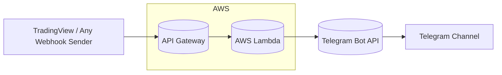
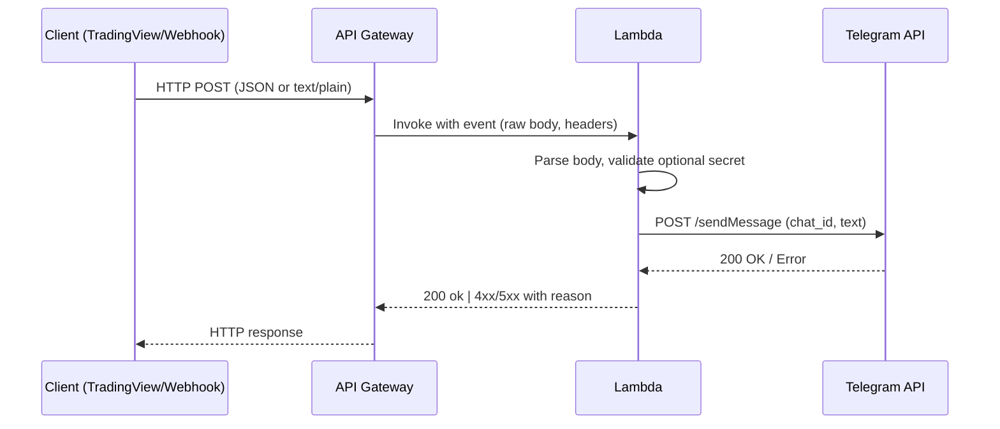

# TradingView → API Gateway → AWS Lambda → Telegram

A lightweight webhook bridge that receives alerts (JSON or `text/plain`) via API Gateway, processes them in AWS Lambda, and forwards the final message to a Telegram channel via a bot. Designed for zero external Python deps (uses `urllib`) and optional Cornix-compatible output.

## Why this exists
- **Simple**: one Lambda, one API route.  
- **Fast**: cold start friendly; no third-party libs.  
- **Flexible**: accepts both `application/json` and `text/plain` (e.g., TradingView alerts).  
- **Secure**: optional shared secret and best-practice hardening.

---

## Architecture



### Request lifecycle (sequence)



---

## Features

- Accepts **`application/json`** and **`text/plain`** bodies
- Optional **shared secret** (header or body) to prevent abuse
- Splits **long messages** into 4096-char chunks (Telegram limit)
- Minimal **retries** on transient Telegram errors
- Optional light **normalization** (e.g., making Cornix parsing easier)
- **Zero dependencies** (no layers/zip hassles)
- Works on **Python 3.11+**

---

## Requirements

- **AWS** account (Lambda, API Gateway, CloudWatch)
- **Telegram Bot** token (via `@BotFather`)  
- **Telegram channel** (bot added as admin) and **chat_id** (`@channelhandle` or `-100xxxxxxxxxx`)
- (Optional) **TradingView** or any webhook sender

---

## Configuration

### Environment variables (Lambda)

| Name            | Required | Example                     | Notes                                    |
|-----------------|----------|-----------------------------|------------------------------------------|
| `BOT_TOKEN`     | ✅       | `123456:ABC...`             | Telegram bot token                        |
| `CHAT_ID`       | ✅       | `@mychannel` or `-100…`     | Target channel/chat                       |
| `WEBHOOK_SECRET`| optional | long random string          | Enable shared-secret validation           |

### IAM permissions (minimal)

The Lambda only needs outbound internet access. If **not** in a VPC, the default Lambda execution role is sufficient.  
If you **attach a VPC**, ensure NAT egress to `api.telegram.org` (HTTPS/443) via route table.

---

## API

### Endpoint
- **HTTP method**: `POST`  
- **Path**: Depends on API Gateway type  
  - **REST API**: `https://<api-id>.execute-api.<region>.amazonaws.com/<stage>/<resource>` (e.g., `/default/TradingViewToTelegram`)  
  - **HTTP API**: `https://<api-id>.execute-api.<region>.amazonaws.com<route>` (typically no `/default` segment)

> This repo assumes a **REST API** with stage `default` and resource `/TradingViewToTelegram`. Adjust if you use HTTP API.

### Request formats

**A) JSON**
```json
{
  "message": "Hello from JSON"
}
```

**B) Plain text (`text/plain`)**
```
ETH/USDT
Leverage 1x
Buy 2460
Sell 2475 2490 2510
Stop 2435
```

**Optional secret**

- Header: `X-Webhook-Token: <WEBHOOK_SECRET>`
- Or in JSON body: `"token": "<WEBHOOK_SECRET>"`  
- Or first line in `text/plain`: `token: <WEBHOOK_SECRET>`

### Responses

- `200 ok` – forwarded to Telegram
- `400` – empty body or missing required field
- `401` – invalid or missing shared secret
- `502` – Telegram API error
- `500` – configuration/runtime error

---

## Lambda Handler (Python 3.11+)

> Drop this into `lambda_function.py`. No external libraries required.

```python
import os, json, base64, time
import urllib.request, urllib.parse, urllib.error

BOT_TOKEN = os.getenv("BOT_TOKEN")
CHAT_ID = os.getenv("CHAT_ID")
WEBHOOK_SECRET = os.getenv("WEBHOOK_SECRET")  # optional
API_URL = f"https://api.telegram.org/bot{BOT_TOKEN}/sendMessage"

def _extract_body(event):
    body = event.get("body") or ""
    if event.get("isBase64Encoded"):
        body = base64.b64decode(body).decode("utf-8", "replace")
    headers = { (k or "").lower(): (v or "") for k, v in (event.get("headers") or {}).items() }
    ctype = headers.get("content-type","").lower()
    if "application/json" in ctype:
        try:
            obj = json.loads(body)
            return obj, headers, True
        except json.JSONDecodeError:
            pass
    return body, headers, False

def _extract_secret(body, headers, is_json):
    if "x-webhook-token" in headers:
        return headers["x-webhook-token"].strip()
    if is_json and isinstance(body, dict):
        return (body.get("token") or body.get("secret") or "").strip()
    text = body if isinstance(body, str) else ""
    first = text.splitlines()[0].strip().lower() if text else ""
    for key in ("token:", "secret:"):
        if first.startswith(key):
            return first.replace(key, "", 1).strip()
    return ""

def _extract_message(body, is_json):
    if is_json and isinstance(body, dict):
        return (body.get("message") or body.get("text") or "").strip()
    return (body if isinstance(body, str) else "").strip()

def _send(text):
    data = urllib.parse.urlencode({"chat_id": CHAT_ID, "text": text}).encode()
    for attempt in range(3):
        try:
            req = urllib.request.Request(API_URL, data=data, method="POST")
            with urllib.request.urlopen(req, timeout=10) as r:
                payload = r.read().decode("utf-8", "replace")
                resp = json.loads(payload)
                if not resp.get("ok"):
                    raise RuntimeError(f"Telegram error: {resp}")
                return
        except (urllib.error.HTTPError, urllib.error.URLError, TimeoutError) as e:
            if attempt == 2:
                raise
            time.sleep(0.5 * (2 ** attempt))

def lambda_handler(event, context):
    if not BOT_TOKEN or not CHAT_ID:
        return {"statusCode": 500, "body": "Missing BOT_TOKEN or CHAT_ID"}

    body, headers, is_json = _extract_body(event)

    if WEBHOOK_SECRET:
        provided = _extract_secret(body, headers, is_json)
        if provided != WEBHOOK_SECRET:
            return {"statusCode": 401, "body": "Unauthorized"}

    msg = _extract_message(body, is_json)
    if not msg:
        return {"statusCode": 400, "body": "Empty body"}

    # Split for Telegram 4096-char limit
    for i in range(0, len(msg), 4096):
        _send(msg[i:i+4096])

    return {"statusCode": 200, "body": "ok"}
```

---

## Deployment

### Option 1 — Console (quick)

1) **Create Lambda**  
- Runtime: Python 3.11 (or 3.13)  
- Handler: `lambda_function.lambda_handler`  
- Paste the code above

2) **Env vars**: add `BOT_TOKEN`, `CHAT_ID`, (optional) `WEBHOOK_SECRET`

3) **API Gateway**  
- **REST API** → Resource `/TradingViewToTelegram` → Method `POST` → Integration: Lambda (proxy)  
- Deploy to stage `default`

4) **Permissions**  
- Allow API Gateway to invoke Lambda (console does this automatically)

5) **Test**
```bash
curl -X POST 'https://<api-id>.execute-api.<region>.amazonaws.com/default/TradingViewToTelegram'   -H 'Content-Type: application/json'   -d '{"message":"Hello from API Gateway to Telegram"}'
```

### Option 2 — HTTP API (alternative)
- Create an **HTTP API** with route `POST /TradingViewToTelegram` (or `ANY /{proxy+}`) → Lambda integration  
- Use the stage **$default** invoke URL (no `/default` in the path)

---

## TradingView setup (example)

- **Webhook URL**: your API Gateway endpoint  
- **Message** (Cornix-friendly, numbers only):
```
ETH/USDT
Leverage 1x
Buy zone 2455-2465
Sell 2475 2490 2510
Stop 2435
```
> Compute numeric TP/SL in Pine and inject them into the alert text. Avoid “Market Price” or “%” take-profits if you rely on Cornix to parse.

---

## Operations

- **Observability**: CloudWatch Logs (function logs), API Gateway access logs (optional)
- **Log retention**: set to 14–30 days
- **Alarms**:
  - API Gateway `5XXError` > 1 over 5m
  - Lambda `Errors` or `Throttles` spikes
- **Scaling**: default concurrency is fine; add limits if needed
- **Timeout/Memory**: 5–10s timeout; 256MB memory is a good baseline

---

## Security

- **Rotate** the Telegram bot token if it was exposed; store in **AWS Secrets Manager** if preferred
- **Shared secret** (`WEBHOOK_SECRET`) enforced in Lambda
- **API protection**: API key / authorizer / WAF / rate limits
- **VPC**: if you attach Lambda to a VPC, ensure **NAT** for egress to Telegram

---

## Troubleshooting

| Symptom | Likely cause | Fix |
|---|---|---|
| `404 Not Found` | Route/path mismatch | Verify API type (REST vs HTTP), stage, and resource path |
| `500 Internal Server Error` | Env vars missing | Set `BOT_TOKEN`, `CHAT_ID` |
| Telegram timeout / errors | Lambda in VPC without NAT; invalid token/chat_id; bot not admin | Ensure NAT egress; verify token/chat_id; add bot as channel admin |
| Body parse error | `text/plain` sent but handler expected JSON | This handler accepts both; ensure correct `Content-Type` if sending JSON |

---

## Roadmap

- Optional **Secrets Manager** loader on cold start
- **Retry/backoff** tuning & DLQ for failed posts
- **Structured logging** with request IDs
- **CORS** preflight if a browser client is added
- **IaC** (CDK/Terraform) module for one-command deploy

---

## License

MIT
