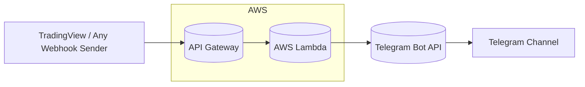
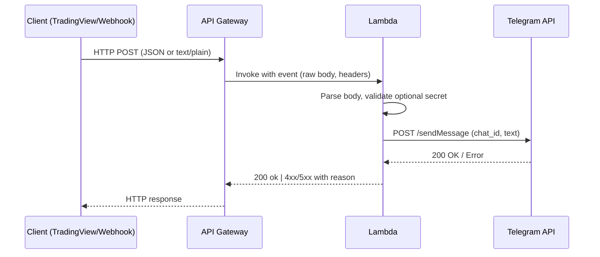

# TradingView → API Gateway → AWS Lambda → Telegram

A lightweight webhook bridge that receives alerts (JSON or `text/plain`) via API Gateway, processes them in AWS Lambda, and forwards the final message to a Telegram channel via a bot. Designed for zero external Python deps (uses `urllib`) and optional Cornix-compatible output.

## Why this exists
- **Simple**: one Lambda, one API route.  
- **Fast**: cold start friendly; no third-party libs.  
- **Flexible**: accepts both `application/json` and `text/plain` (e.g., TradingView alerts).  
- **Secure**: optional shared secret and best-practice hardening.

---

## Architecture



### Request lifecycle (sequence)



---

## Features

- Accepts **`application/json`** and **`text/plain`** bodies
- Optional **shared secret** (header or body) to prevent abuse
- Splits **long messages** into 4096-char chunks (Telegram limit)
- Minimal **retries** on transient Telegram errors
- Optional light **normalization** (e.g., making Cornix parsing easier)
- **Zero dependencies** (no layers/zip hassles)
- Works on **Python 3.11+**

---

## Requirements

- **AWS** account (Lambda, API Gateway, CloudWatch)
- **Telegram Bot** token (via `@BotFather`)  
- **Telegram channel** (bot added as admin) and **chat_id** (`@channelhandle` or `-100xxxxxxxxxx`)
- (Optional) **TradingView** or any webhook sender

---

## Configuration

### Environment variables (Lambda)

| Name            | Required | Example                     | Notes                                    |
|-----------------|----------|-----------------------------|------------------------------------------|
| `BOT_TOKEN`     | ✅       | `123456:ABC...`             | Telegram bot token                        |
| `CHAT_ID`       | ✅       | `@mychannel` or `-100…`     | Target channel/chat                       |
| `WEBHOOK_SECRET`| optional | long random string          | Enable shared-secret validation           |

### IAM permissions (minimal)

The Lambda only needs outbound internet access. If **not** in a VPC, the default Lambda execution role is sufficient.  
If you **attach a VPC**, ensure NAT egress to `api.telegram.org` (HTTPS/443) via route table.

---

## API

### Endpoint
- **HTTP method**: `POST`  
- **Path**: Depends on API Gateway type  
  - **REST API**: `https://<api-id>.execute-api.<region>.amazonaws.com/<stage>/<resource>` (e.g., `/default/TradingViewToTelegram`)  
  - **HTTP API**: `https://<api-id>.execute-api.<region>.amazonaws.com<route>` (typically no `/default` segment)

> This repo assumes a **REST API** with stage `default` and resource `/TradingViewToTelegram`. Adjust if you use HTTP API.

### Request formats

**A) JSON**
```json
{
  "message": "Hello from JSON"
}
```

**B) Plain text (`text/plain`)**
```
ETH/USDT
Leverage 1x
Buy 2460
Sell 2475 2490 2510
Stop 2435
```

**Optional secret**

- Header: `X-Webhook-Token: <WEBHOOK_SECRET>`
- Or in JSON body: `"token": "<WEBHOOK_SECRET>"`  
- Or first line in `text/plain`: `token: <WEBHOOK_SECRET>`

### Responses

- `200 ok` – forwarded to Telegram
- `400` – empty body or missing required field
- `401` – invalid or missing shared secret
- `502` – Telegram API error
- `500` – configuration/runtime error

---

## Lambda Handler (Python 3.11+)

> Drop this into `lambda_function.py`. No external libraries required.

```python
import os
import json
import urllib.request
import urllib.parse

def lambda_handler(event, context):
    print("🚨 LAMBDA STARTED")
    
    try:
        body_raw = event.get("body", "")
        print(f"🔍 RAW BODY: {body_raw}")
        print(f"🔍 BODY TYPE: {type(body_raw)}")
        
        # Handle both JSON and plain text from TradingView
        if body_raw.startswith('{"') and body_raw.endswith('}'):
            # It's JSON format (like your curl tests)
            print("📄 PARSING AS JSON")
            body = json.loads(body_raw)
            msg = body["message"]
        else:
            # It's plain text from TradingView (like your actual alerts)
            print("📄 USING PLAIN TEXT FROM TRADINGVIEW")
            msg = body_raw
        
        print(f"✅ FINAL MESSAGE: {msg}")

        bot_token = os.getenv("BOT_TOKEN")
        chat_id = os.getenv("CHAT_ID")
        
        if not bot_token or not chat_id:
            return {"statusCode": 500, "body": "Missing BOT_TOKEN or CHAT_ID"}

        # Send to Telegram
        url = f"https://api.telegram.org/bot{bot_token}/sendMessage"
        data = urllib.parse.urlencode({"chat_id": chat_id, "text": msg}).encode()
        
        req = urllib.request.Request(url, data=data, method='POST')
        with urllib.request.urlopen(req, timeout=10) as response:
            if response.status != 200:
                raise Exception(f"Telegram API returned status {response.status}")
        
        print("✅ TELEGRAM MESSAGE SENT SUCCESSFULLY")
        return {"statusCode": 200, "body": "ok"}

    except Exception as error:
        print(f"❌ ERROR: {str(error)}")
        return {"statusCode": 500, "body": f"Error: {str(error)}"}
```

---

## Telegram & Cornix Wiring

This project uses **Telegram** as the distribution layer and **Cornix** as the signal parser/execution layer.

### 1) Create your Telegram Bot & Channel

1. In Telegram, talk to **@BotFather** → `/newbot` → copy the **bot token** (set as `BOT_TOKEN` in Lambda).
2. Create a **Telegram Channel** (public `@handle` or private). This channel is your **signal source** (set its ID/handle as `CHAT_ID` in Lambda).
3. Add your bot **as an Admin** of the channel (can post messages). If the channel is private, adding the bot is required so it can post.
4. Get the channel ID:  
   - For public: use `@yourchannelhandle`  
   - For private: numeric id like `-100xxxxxxxxxx` (you can obtain it via Telegram API `getUpdates` or tools like `@userinfobot`).

> The Lambda posts the incoming webhook text **into this channel**.

### 2) Connect the channel to Cornix

Cornix watches your Telegram channel and parses each new message:
- In **Cornix Admin** (or app), add your **Signal Source** = your Telegram Channel.
- Add the **Cornix Bot** (or the bot specified by Cornix for your plan) **as an Admin** in the same channel so it can read/process messages.
- Ensure your messages follow **Cornix Free Text** or **Publish Signal** formats (numeric entries/TP/SL, e.g., `Buy 2460`, `Sell 2475 2490`, `Stop 2435`).

> Flow: **Lambda → Telegram Channel (signal source) → Cornix Bot → Users’ Exchange Accounts**.  
> Cornix executes trades on the subscribers’ exchanges via their **API keys** configured within Cornix, based on your parsed signals.

### 3) Message format tips for Cornix parsing

- Use `BASE/QUOTE` pairs (e.g., `ETH/USDT`), **numbers** for entries/TP/SL, and optional `Leverage 1x`.
- Avoid “Market Price” (use numeric price or `Buy at current price`) and avoid percentage-only TP like `0.3%`. Provide numbers.
- Minimize emojis/decoration to reduce parsing ambiguity.
- You can still post non-Cornix messages; Cornix will ignore what it can’t parse.

**Example (Cornix-friendly):**
```
ETH/USDT
Leverage 1x
Buy zone 2455-2465
Sell 2475 2490 2510
Stop 2435
```

### 4) Testing the pipeline

1. `curl` → API Gateway → confirm Lambda returns `200 ok`.
2. Verify the message **appears in your Telegram channel**.
3. Confirm **Cornix** shows the parsed signal (and, if enabled, posts the follow button / executes per user settings).

### 5) Operational notes

- **Bot token security**: rotate if ever exposed (via `@BotFather`) and update the Lambda env var.
- **Channel admin rights**: both your bot and the Cornix bot must be admins (read/post as needed).
- **Scaling**: Cornix limits publish rate; throttle upstream if you generate bursts.
- **Auditability**: use channel history as an immutable log of signals; optionally mirror to an S3 bucket via a secondary Lambda subscriber.

---


---

## Deployment

### Option 1 — Console (quick)

1) **Create Lambda**  
- Runtime: Python 3.11 (or 3.13)  
- Handler: `lambda_function.lambda_handler`  
- Paste the code above

2) **Env vars**: add `BOT_TOKEN`, `CHAT_ID`, (optional) `WEBHOOK_SECRET`

3) **API Gateway**  
- **REST API** → Resource `/TradingViewToTelegram` → Method `POST` → Integration: Lambda (proxy)  
- Deploy to stage `default`

4) **Permissions**  
- Allow API Gateway to invoke Lambda (console does this automatically)

5) **Test**
```bash
curl -X POST 'https://<api-id>.execute-api.<region>.amazonaws.com/default/TradingViewToTelegram'   -H 'Content-Type: application/json'   -d '{"message":"Hello from API Gateway to Telegram"}'
```

### Option 2 — HTTP API (alternative)
- Create an **HTTP API** with route `POST /TradingViewToTelegram` (or `ANY /{proxy+}`) → Lambda integration  
- Use the stage **$default** invoke URL (no `/default` in the path)

---

## TradingView setup (example)

- **Webhook URL**: your API Gateway endpoint  
- **Message** (Cornix-friendly, numbers only):
```
ETH/USDT
Leverage 1x
Buy zone 2455-2465
Sell 2475 2490 2510
Stop 2435
```
> Compute numeric TP/SL in Pine and inject them into the alert text. Avoid “Market Price” or “%” take-profits if you rely on Cornix to parse.

---

## Operations

- **Observability**: CloudWatch Logs (function logs), API Gateway access logs (optional)
- **Log retention**: set to 14–30 days
- **Alarms**:
  - API Gateway `5XXError` > 1 over 5m
  - Lambda `Errors` or `Throttles` spikes
- **Scaling**: default concurrency is fine; add limits if needed
- **Timeout/Memory**: 5–10s timeout; 256MB memory is a good baseline

---

## Security

- **Rotate** the Telegram bot token if it was exposed; store in **AWS Secrets Manager** if preferred
- **Shared secret** (`WEBHOOK_SECRET`) enforced in Lambda
- **API protection**: API key / authorizer / WAF / rate limits
- **VPC**: if you attach Lambda to a VPC, ensure **NAT** for egress to Telegram

---

## Troubleshooting

| Symptom | Likely cause | Fix |
|---|---|---|
| `404 Not Found` | Route/path mismatch | Verify API type (REST vs HTTP), stage, and resource path |
| `500 Internal Server Error` | Env vars missing | Set `BOT_TOKEN`, `CHAT_ID` |
| Telegram timeout / errors | Lambda in VPC without NAT; invalid token/chat_id; bot not admin | Ensure NAT egress; verify token/chat_id; add bot as channel admin |
| Body parse error | `text/plain` sent but handler expected JSON | This handler accepts both; ensure correct `Content-Type` if sending JSON |

---

## Roadmap

- Optional **Secrets Manager** loader on cold start
- **Retry/backoff** tuning & DLQ for failed posts
- **Structured logging** with request IDs
- **CORS** preflight if a browser client is added
- **IaC** (CDK/Terraform) module for one-command deploy

---

## License

MIT
